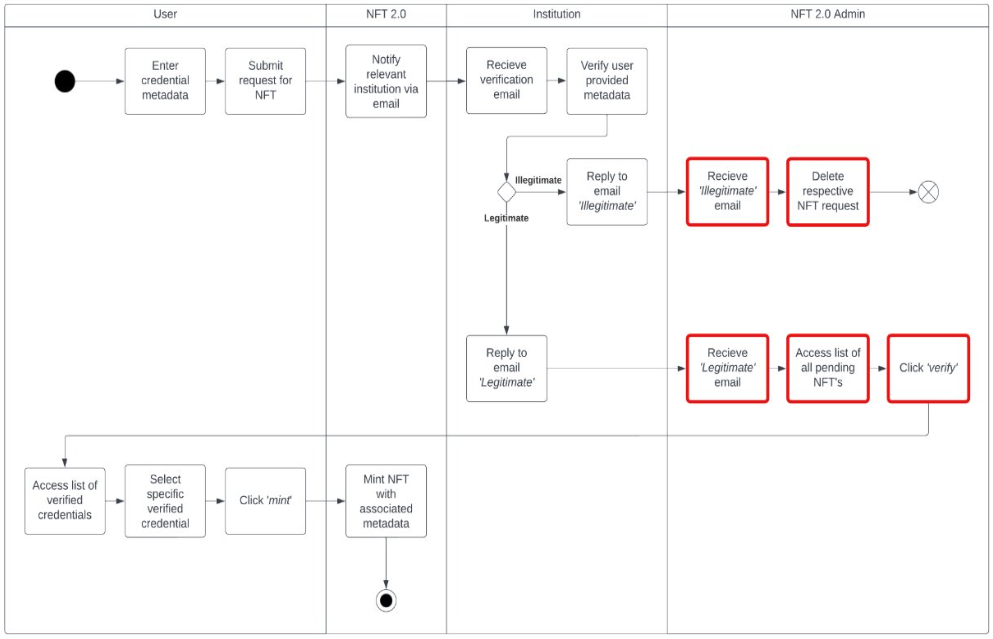
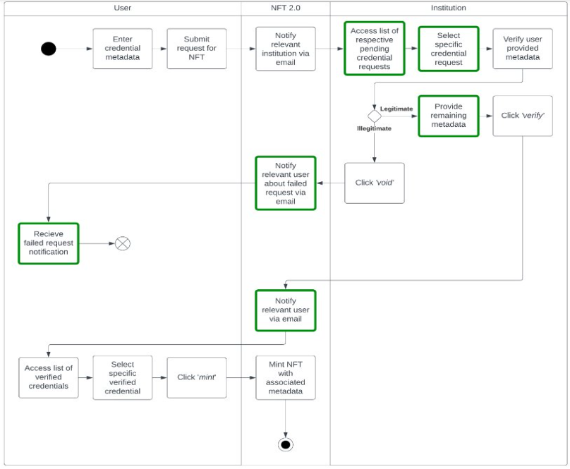
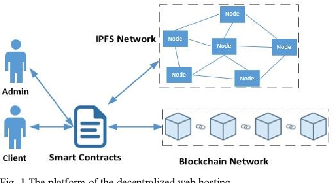

# NFT2.0 - Immutable and Non-transferable Qualifications

#### 2024 S1 Tech Launcher
___

## Introduction

*Finding your credentials are difficult to track, lost, or destroyed?  
or do you have so many credentials it's difficult to keep track of?*

*Our platform **Immutable** allows for a secure, non-fungible method of storing your credentials
in the blockchain, free from external tampering. Using NFT technology, A modern
UI language, and a memory safe stack, our platform Immutable allows for users to have there
credentials verified by the respective institution and minted to a block-chain.*

### Background

Envision a platform, where all of your achievements and qualifications, whether
they be microcredentials, certificates, licences, or degrees are encapsulated
in non-fungible tokens, verified and tamper-proof from malicious actors.

Immutable invites you to this world, where your credentials are not
merely recognized but respected and indisputably verified.

### Project Value

Welcome to Immutable, your straightforward solution for qualification
verification using blockchain technology. With just a few easy clicks,
Immutable enables you to convert your qualifications into non-fungible
tokens and securely store them on the blockchain.  

It can even store and verify microcredentials, ensuring users can properly
express and verify all of their achievements to broaden there achievements list.  

Consequently, NFT-based qualifications pave the way for a more streamlined
and secure verification process, while simultaneously providing a potent
tool for users to highlight their accomplishments and elevate their
professional presence effectively.  

Immutable opens avenues to smarter, cost-effective verification, seamlessly
connecting individuals and businesses while allowing qualification issuers
to be part of a groundbreaking verification ecosystem.  

### What Credentials are Being Stored

**Our platform aims to provide the required information necessary to substantiate the existence of both 
AQF award qualifications (such as Certificates, Diplomas, Bachelors Degrees, etc...) as well as microcedentials.**  

A **microcredential**, as defined by the [National Microcredential Framework (NMF)](Resources/National%20Microcredentials%20Framework%20-%20Final%20Framework.pdf), is:  

***a certification of assessed learning or competency, with a minimum volume of
learning of one hour and less than an AQF award qualification, that is additional, alternate,
complementary to or a component part of an AQF award qualification.***

The same document goes on to include the following as examples of a microcredential: 
- VET skill sets or units of competency. 
- Modularised, assessed components of existing higher education curriculum orsubjects.
- Industry learning that is assessed (such as vendor certifications, professional learning). 
- Other forms of assessed learning or competencies (e.g. Vocational Education/ Higher Education
  / Industry courses not currently accredited by a regulatory authority, and those by other providers).

## The Platform Structure (as of 2023-S2)

Prior to this semester the platform was only designed to stored AQF credentials (degrees, diplomas, etc). A user would create an account on the platform, fill in a NFT request form, and provide the enquires email address of the institution. From there an email is automatically sent to the institution, and they are prompted to respond with either 'legitimate' or 'illegitimate'. 

That email is then received by an admin of the platform who will either:
- if 'legitimate': deletes the NFT request through an admin page on the site.
- if 'illegitimate': click a verify button on their end which sends a notification to the user and allows them to mint there credential.

  
*The old process flow diagram of the platform* - **Image provided by Contour Advisory**

## Current Deliverables Breakdown
___

### National Microcredential Framework Compliance
***Ensure the NFT 2.0 platform aligns with the National Microcredential Framework by integrating all necessary metadata and adhering to the Department of Education’s Qualification Framework.***

Our client, [Contour Advisory](https://www.contouradvisory.com.au/), intends on showing the Immutable platform to the Australian Department of Education, Skills and Employment.
However, in order for this platform to be considered for there recommendation, our platform needs to be compliant with the specifications outlined in section 4.0 of the [National Microcredential Framework (NMF)]().  

Section 4.0 of the NMF outlines 23 sections of meta-data that needs to be stored with the microcredential.
some of these metadata fields listed are recommended, others are critical. 
However, our client has specified that all meta-data fields should be configurable by the user.  

This deliverable will involve modifying the existing NFT Request Form, which is a part of the frontend of the platform.
The backend layer will also need to be modified to include the new meta-data fields, which will also include modifying the existing SQL database.  

This deliverable also serves as an introduction to the codebase to allow new members to familiarize themselves with modifying interfaces and changing the backend.

### Application Process Uplift
***Automate the institution verification process to facilitate real-time approvals of user NFT requests, thereby enhancing the efficiency and responsiveness of the NFT 2.0 administration.***

This deliverable addresses the process of the overall platform, and aims to remove the *admin* role from the process of verifying and minting an NFT credential.

This involves modifying the request email sent to an institution, which will now also prompt them to login or create an account on the platform, where they can modify or add additional meta-data fields to the request. They can then either reject the request or accept it. Upon an institution creating an account they will also be able to see all pending NFT requests associated with there email address. Once accepted, the user is then notified and can then choose to mint the NFT on their end. 

  
*The new process flow diagram of the platform* - **Image provided by Contour Advisory**

This deliverable requires the team to overhaul or modify multiple frontend and backend modules, and is expected to be far more difficult than deliverable 1.

### Decentralised Hosting
***Identify and implement a suitable decentralized hosting solution from top candidates to ensure the NFT 2.0 platform is robust, secure, and capable of operating on a global scale.***

This is mostly a research deliverable where we are required to outline possible solutions to migrating the platform from a centralized server to a robust decentralized hosting network.
The research document can be found [here](Research/Decentralized-Hosting.md)

Decentralized hosting is where a website or platform is hosted on multiple servers which communicate with each other through encrypted peer-to-peer (P2P) messages. THe advantage of this solution is that it is easy to scale up the platform and data is more securely stored.

A stretch goal of this deliverable is to implement the solution on multiple test servers and show the platform operating within an acceptable latency (added latency between server-to-server requests).

  
*The structure of a website using decentralized hosting* - **Image from [A Decentralized Solution for Web Hosting](https://www.semanticscholar.org/paper/A-Decentralized-Solution-for-Web-Hosting-Huynh-Nguyen/6493e364742d63fc55547cbbea1100804e86887f)**

**if this stretch goal is not completed this semseter, then implementation will liekly be a deliverable of next semesters work.**

### Project Maintenance
***Continuously improve the NFT 2.0 platform's UI/UX for better user experience while maintaining system integrity through regular bug fixes and updates to the Systems Architecture Document (SAD).***

An ongoing deliverable which is in parallel with the prior three deliverables. The System Architecture Document is a technical document with added comments of the developers detailing an honest account of whether a function or module has: known bugs, is poorly written, is inefficent, is low quality, etc...

## Quick Links
___

### Project Output
Project management is only conducted through GitHub   
[Milestones (GitHub)](https://github.com/perspicacious-slinki/Immutable2024s1ANUTechlauncher/milestones?direction=asc&sort=due_date&state=open) &ensp;&ensp;&ensp;&ensp;&ensp;&ensp;&ensp;
[Status Board (GitHub)](https://github.com/users/perspicacious-slinki/projects/5/views/3) &ensp;&ensp;&ensp;&ensp;&ensp;&ensp;&ensp;
[RoadMap (GitHub)](https://github.com/users/perspicacious-slinki/projects/5/views/2)  
[User Story Map (Excel)](Artifacts/NFT2.0---Immutable-Qualification-Complete-USM---CompleteMarksAdded%20(1).xlsx) &ensp;&ensp;&ensp;&ensp;
[Risks Assessment](Artifacts/2024S1-Risk_Log.md) &ensp;&ensp;&ensp;&ensp;&ensp;&ensp;&ensp;&ensp;&ensp;&ensp;
[Decentralized Hosting](Research/Decentralized-Hosting.md)

### Meeting Minutes
Decision log and reflection log is integrated into meeting minutes   
[Team Meeting Minutes](https://github.com/perspicacious-slinki/Immutable2024s1ANUTechlauncher/tree/documentation/2024-Documentation/Meeting%20Minutes/Team) &ensp;&ensp;&ensp;&ensp;&ensp;
[Client Meeting Minutes](https://github.com/perspicacious-slinki/Immutable2024s1ANUTechlauncher/tree/documentation/2024-Documentation/Meeting%20Minutes/Client) &ensp;&ensp;&ensp;&ensp;&ensp;&ensp;
[Tutorial Meeting Minutes](https://github.com/perspicacious-slinki/Immutable2024s1ANUTechlauncher/tree/documentation/2024-Documentation/Meeting%20Minutes/Tutorial)  

### Administrative
Contracts, roles, and responsibilities.   
[Statement of Work](Admin/2024S1-Statement%20of%20Work%20-%20Signed.pdf) &ensp;&ensp;&ensp;&ensp;&ensp;&ensp;&ensp;&ensp;&ensp;
[Team Charter](Admin/2024S1-Team%20Charter.docx) &ensp;&ensp;&ensp;&ensp;

### Presentaiton
The poster and link to the promotional video.   
[Audit 1 Slides](Presentation/Audit/NFT2.0%20Audit%201.pdf) &ensp;&ensp;&ensp;&ensp;&ensp;&ensp;&ensp;&ensp;&ensp;&ensp;&ensp;&ensp;&ensp;&ensp;
[Audit 2 Slides](Presentation/Audit/NFT2.0%20Audit%202.pdf) &ensp;&ensp;&ensp;&ensp;&ensp;&ensp;&ensp;&ensp;&ensp;&ensp;&ensp;&ensp;&ensp;&ensp;
[Audit 3 Slides](Presentation/Audit/NFT2.0%20Audit%203.pdf)  
[2024-S1 Poster](Presentation/Immutable-Poster.pdf) &ensp;&ensp;&ensp;&ensp;&ensp;&ensp;&ensp;&ensp;&ensp;&ensp;&ensp;&ensp;
[2024-S1 Video](https://www.youtube.com/watch?app=desktop&v=5tekChgSwHk&feature=youtu.be)

### Deprecated Links
These links exist for reference only, all resources relevant to the project should be found above  
***Please disregard these links / should not be assessed***   
[Legacy Landing Page](https://meikaigroupcom.sharepoint.com/sites/NFT2.0ImmutableQualifications/SitePages/Home.aspx?csf=1&web=1&e=XFJih1&ovuser=884d7198-d310-4fed-95cb-2e94b7f3873e%2cu7284995%40anu.edu.au&OR=Teams-HL&CT=1711345150602&clickparams=eyJBcHBOYW1lIjoiVGVhbXMtRGVza3RvcCIsIkFwcFZlcnNpb24iOiI0OS8yNDAyMTUyODYxNSIsIkhhc0ZlZGVyYXRlZFVzZXIiOmZhbHNlfQ%3d%3d&cid=ec19fb5f-d9ba-430c-928b-a80d7724b224) 

