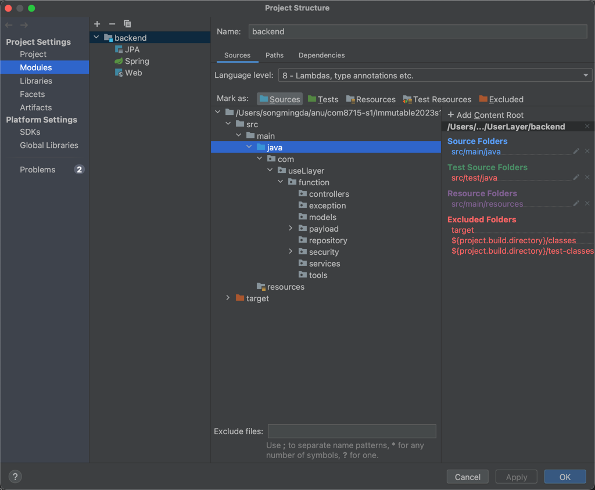
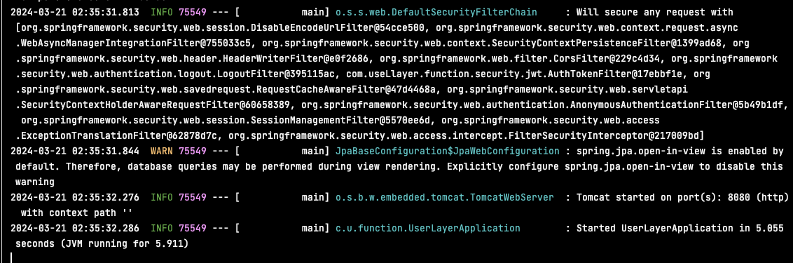
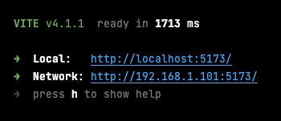

# SETUP GUIDE

## API

[API_document.md](API_document.md)

## Getting Started

To run this application, you will need to have the following software installed on your computer:

test on Java 17 ,18, 19

MySQL 8.x

## Installation

1. Clone this repository to your local machine using the following command:

   ``git clone https://github.com/perspicacious-slinki/Immutable2023s1ANUTechlauncher.git``

2. Change into the project directory:

   ``cd Immutable2023s1ANUTechlauncher``

3. Install the backend dependencies:

   Download Maven first!! Find pom.xml(- UserLayer/backend/pom.xml ) under the  backend folder, and click the Maven icon-> Maven -> Reload project.

4. Create a new MySQL database(for example: mydb) and insert roles below:

   ```
   CREATE DATABASE mydb;
   USE mydb;
   ```

5. Update the application.properties file located in the src/main/resources directory to reflect your MySQL

   ```
   spring.datasource.url=jdbc:mysql://localhost:3306/mydb?useUnicode=true&characterEncoding=UTF-8
   ```

   The cloned resources will usually contain this line of code directly, so in most cases this step can be skipped.

6. Create a new file named **.env** on the root folder(**./Immutable2023s1ANUTechlauncher/**). 

   Create a blank .txt file on the root folder and rename it into .env

   ```
   mv FILE_NAME.txt .env
   ```

   Populate the .env file with the following:

   ```
   SPRING_DATASOURCE_PASSWORD=YOUR_DATABASE_PASSWORD
   USERLAYER_APP_JWT_SECRET=YOUR_JWT_SECRET
   # FOR SENDING VALIDATION EMAIL
   SPRING_MAIL_USERNAME=YOUR_SERVER_EMAIL_ADRESS
   SPRING_MAIL_PASSWORD=YOUR_SERVER_EMAIL_PASSWORD
   # FOR WEB3STORAGE EMAIL
   WEB3STORAGE_EMAIL=YOUR_WEB3STORAGE_EMAIL
   ```
   Ps: This step may require downloading the .env plugins.

   For WEB3STORAGE_EMAIL, you need to register your own web3.storage account and fill in your email address. Please note that uploading items via email for the first time requires verification of this email.

   Here is the link: https://web3.storage/


7. Start the backend service(will fail this time)

   (Way 1)
   If you are using intellij IDEA, Please make sure you have rightly config the modules:
   Then right click UserLayerApplication and run

   (Way 2) Install maven and run:

   ```
   cd backend
   mvn spring-boot:run
   ```
   If you have done the above command correctly, the backend server will fail this time, then insert below lines into our database

   ```
   INSERT INTO roles(name) VALUES('ROLE_USER');
   INSERT INTO roles(name) VALUES('ROLE_MODERATOR');
   INSERT INTO roles(name) VALUES('ROLE_ADMIN');
   INSERT INTO roles(name) VALUES('ROLE_INSTITUTION');
   ```

   After all the steps above, when UserLayerApplication run, it should like:

   

8. Install the frontend dependencies and start the frontend development server:

   ```
   cd frontend
   npm install
   npm create vite@latest
   npm run dev
   ```

   

9. Start the backend service again, so far we have done environment setup.

## Docker SETUP GUIDE

1. Install Mysql locally.
2. Entry Mysql console and create database.
```
CREATE DATABASE mydb;
USE mydb;
```
3. Motify these configuration attributes in Dockerfile.
   Here is the link to apply web3 storage account: https://web3.storage/.  
   `<YOUR_MYSQL_PASSWORD>` is the password of local database.  
   `<YOUR_WEB3STORAGE_EMAIL>` is the email signed up in web3 storage.
   MySQL password and web3 storage email is necessary for basic function.
```
ARG YOUR_DATABASE_PASSWORD=<YOUR_MYSQL_PASSWORD>
ARG YOUR_JWT_SECRET=<YOUR_JWT_SECRET>
ARG YOUR_SERVER_EMAIL_ADRESS=<YOUR_SERVER_EMAIL_ADRESS>
ARG YOUR_SERVER_EMAIL_PASSWORD=<YOUR_SERVER_EMAIL_PASSWORD>
ARG YOUR_WEB3STORAGE_EMAIL=<YOUR_WEB3STORAGE_EMAIL>
```
4. Build docker image, use the command at the same directory of Dockerfile in Terminal.
```
docker build -t immutable:latest .
```
5. Run the docker if the image built successfully. Change ``/Your/Path/ANU/COMP8715-GroupProject/Immutable2023s1ANUTechlauncher/DockerLog`` into your path in the project file locally, which is used to mount the log folder.
```
docker run -p 5173:5173 -p 8080:8080 -v /Your/Path/ANU/COMP8715-GroupProject/Immutable2023s1ANUTechlauncher/DockerLog:/usr/src/Immutable/DockerLog -d --name immutable-docker1.1 immutable
```
6. When the first time running the container, if the container run successfully the tables will be created in the database named `mydb`. Then Insert roles into table `role`. Use these commend in Mysql console.
```
INSERT INTO roles(name) VALUES('ROLE_USER');
INSERT INTO roles(name) VALUES('ROLE_MODERATOR');
INSERT INTO roles(name) VALUES('ROLE_ADMIN');
```
7. The command used to stop or start the container.
```
docker stop immutable-docker1.1
```
```
docker start immutable-docker1.1
```
